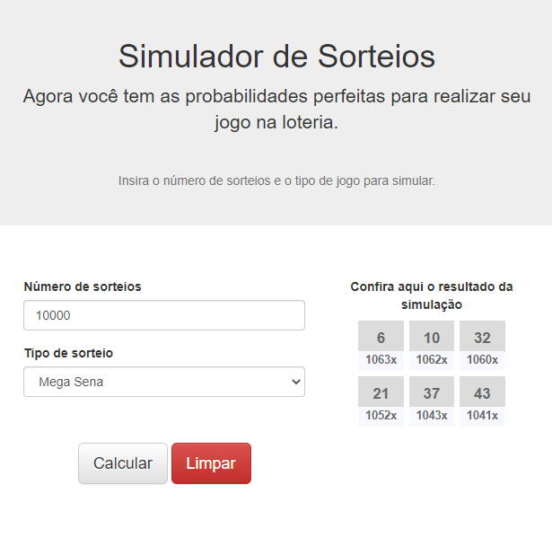

# Simulador de Sorteios

Projeto desenvolvido para fins de aprendizado sobre geração de valores randômicos e acordo com as regras de alguns do prêmios da loteria.
- Mega Sena
- Lotomania
- Lotofácil
- Quina

## Como funciona

O usuário deve informar a quantidade de sorteios gostaria de realizar e o tipo de aposta gostaria de fazer.
O sistema se encarrega de registrar os sorteios realizados e classificar os númeross de acordo com a quantidade de vezes que foram sorteados.

## Interface

  

<!--  -->